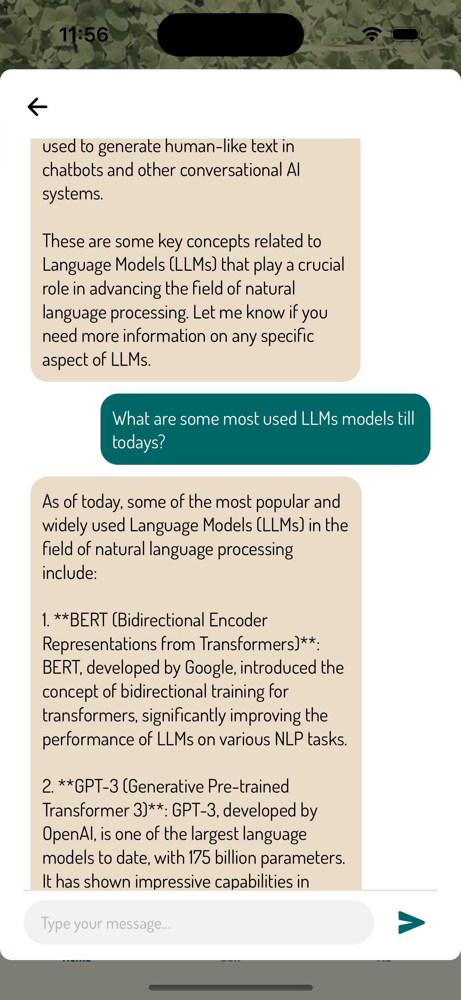
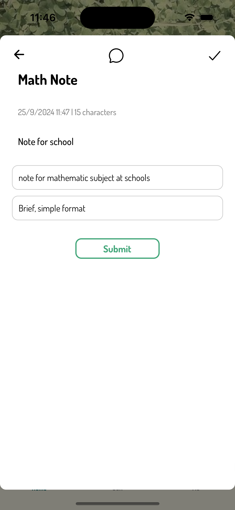
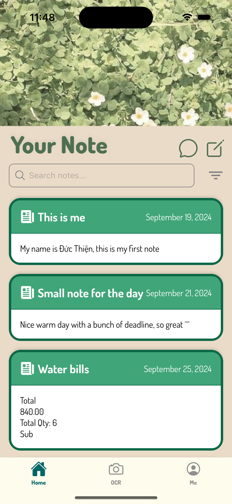
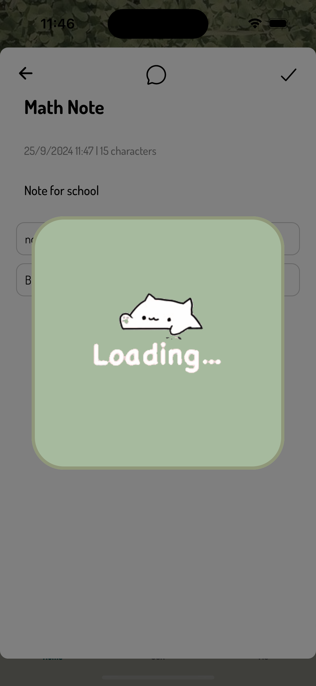
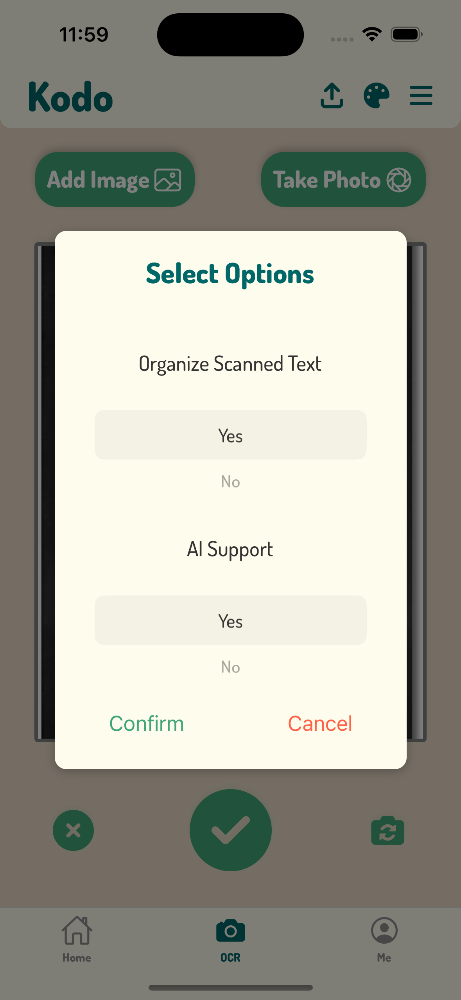
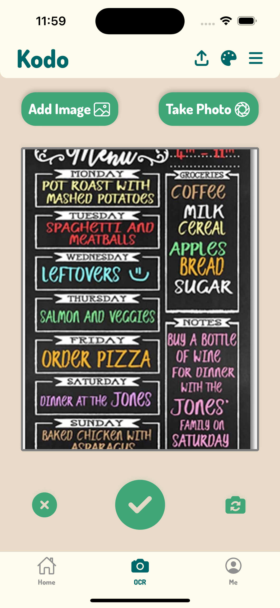
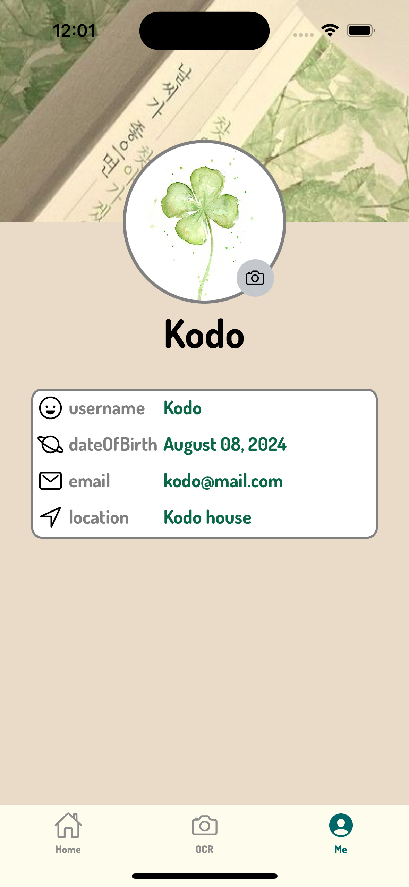

# 🎉 Welcome to **Kodo** - A Noting App with OCR Integration 👋

**Kodo** is a personalized note-taking application that leverages the power of **OCR (Optical Character Recognition)** for seamless text extraction. While initially built for personal use, you're welcome to explore, customize, and make it your own!

## 🌟 Key Features:
- Effortless note-taking with OCR technology.
- Clean and intuitive user interface.
- Secure storage and cloud integration for your notes and data.
- AI-powered features to streamline your productivity.

## 💻 Tech Stack:
- **React Native (Expo)** - Frontend development.
- **ElysiaJS with Bun** - Backend development.
- **Cloud MongoDB, AWS S3, Google Cloud** - For data storage and hosting.
- **Flask** - Managing the AI-powered OCR API.

---
## 📱 Application Demo

### Chat Bot Interaction
The chat bot screen allows users to interact with AI-powered features that assist in note generation.


### Creating Note with LLMs
This screen shows how users can create a note with the help of large language models (LLMs) for additional assistance, such as generating ideas or creating content.


### Home Screen
The home screen offers an intuitive overview of your notes, providing easy access to scan or create new notes.


### Loading Note Creation
While creating a note, a loading screen appears as the app processes the information.


### Scan Options
The scan options screen allows users to select preferences for OCR scanning before proceeding.


### Scanning
The scan screen visualizes the real-time text extraction process, leveraging OCR technology.


### User Profile
The user profile section enables customization of personal information and app settings.


---

## 🚀 Getting Started -- Running The Application Locally

### Running the AI Base (OCR functionality)

1. **Install dependencies**:
    ```bash
    cd ./ai_base
    pip install -r requirements.txt
    ```

2. **Start the Flask application**:
    ```bash
    flask --app app run
    ```

---

### Running the Backend

1. **Install dependencies**:
    ```bash
    cd ./backend
    bun install
    ```

2. **Start the backend server**:
    ```bash
    bun start
    ```

---

### Running the Frontend

1. **Install dependencies**:
    ```bash
    cd ./frontend
    npm install
    ```

2. **Start the Expo app**:
    ```bash
    npx expo start
    ```

---

### Additional Configuration
To be able to run the project, you must fill required enviroment variables that listed in the `env_template` file in each directory with your own values, keys.

## 🛠️ Contributing

Contributions are welcome! If you have ideas or improvements, feel free to submit a pull request or open an issue.

## 📧 Contact

For any queries or support, please reach out to [huynhducthien41906@gmail.com](mailto:huynhducthien41906@gmail.com).

---

Enjoy using **Kodo**, and happy noting! ✨
